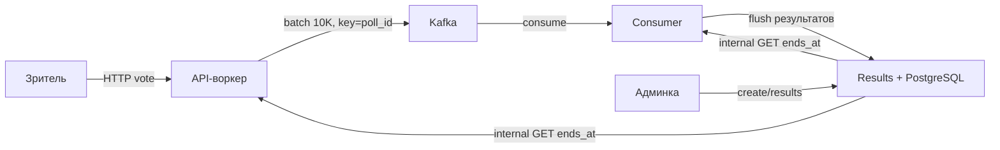

# План реализации highload-poll-backend

> **Статус: ВЫПОЛНЕНО.** Реализация завершена, тесты зелёные, e2e и нагрузочный
> прогон пройдены. Детали по итогам — в
> [`docs/ai-artifacts/handoff.md`](../docs/ai-artifacts/handoff.md) и
> [`docs/ai-artifacts/work-log.md`](../docs/ai-artifacts/work-log.md).

## Контекст

Архитектура согласована (см. [`docs/architecture/04-architecture.md`](../docs/architecture/04-architecture.md)).
Реализация в Docker-ориентированном виде: каждый сервис поднимается контейнером,
интеграционные тесты прогоняются через моки, нагрузочный тест — против
запущенного docker-compose.

## Итоги прогонов

- `go test -race ./...` — все интеграционные тесты зелёные.
- `KEEP=1 ./scripts/e2e.sh` — полный e2e в Docker пройден.
- `go run ./loadtest -c 300 -d 15s` — ~12–16K RPS, 0 ошибок, p99 40–66 ms.

## Общая схема



## Решения (зафиксированы)

- **Структура:** один Go-модуль monorepo. Каталоги: `cmd/api`, `cmd/consumer`,
  `cmd/results`, `internal/*`, `specs/`, `test/`, `loadtest/`, `migrations/`.
- **Go:** 1.22+; HTTP — stdlib `net/http`; Kafka — `segmentio/kafka-go`;
  PostgreSQL — `pgx/v5`.
- **Админка:** без аутентификации (тестовое задание).
- **Спеки:** markdown-документы в `specs/` — по одному на сервис.
- **Тесты:** интеграционные с моками (зависимости через интерфейсы, фейки
  записывают вызовы). Unit-тесты не требуются.
- **Нагрузка:** k6-скрипты в `loadtest/` против поднятого docker-compose.

## Добавление к архитектуре (разрешение пробела)

`04-architecture.md` требует «403 после ends_at» на API-воркере, но не описывает,
откуда API узнаёт `ends_at`. Решение: results-сервис держит внутренние эндпоинты:

- `GET /internal/polls/{id}` — метаданные + `ends_at` (используют API-воркер с
  локальным кэшем `poll_id → ends_at`, и consumer);
- `POST /internal/polls/{id}/results` — идемпотентный flush от consumer.

## Контракты API

### 1. API-воркер (порт 8080)

| Метод | Путь | Описание |
|---|---|---|
| GET | `/polls/{id}` | Метаданные опроса + `Set-Cookie: voter_id=<UUID>` |
| POST | `/polls/{id}/vote` | Принять голос `{option_id}` |
| GET | `/healthz` | Healthcheck |

- `POST /vote`: `202` при принятии (async), `403` «poll closed» после `ends_at`
  (+ досылка «done»), `400` при невалидном `option_id`.
- fingerprint = cookie `voter_id` (UUID) || `sha256(IP + "|" + User-Agent)`.
- Буфер 10K голосов на poll_id → batch produce в Kafka.

### 2. Results (порт 8081)

| Метод | Путь | Описание |
|---|---|---|
| POST | `/admin/polls` | Создать опрос |
| GET | `/admin/polls/{id}/results` | Результаты опроса |
| GET | `/internal/polls/{id}` | Метаданные + `ends_at` |
| POST | `/internal/polls/{id}/results` | Идемпотентный flush результатов |
| GET | `/healthz` | Healthcheck |

- Flush идемпотентен: `UPDATE ... WHERE status != 'completed'`.

### 3. Consumer (без внешнего HTTP, кроме `/healthz`)

Kafka consumer group; локальная дедупликация `map[fingerprint]bool`;
счётчики `map[pollID][optionID]int`; сбор `worker_id`; завершение по «done»-аппрувам
(порог Y% / остывание); идемпотентный flush в results; commit offset после OK.

## Формат Kafka-сообщений

Топик `votes`, key = poll_id, LZ4, retention 5 мин.

```json
{"poll_id":"...","worker_id":"...","votes":[{"fingerprint":"...","option_id":1}]}
{"poll_id":"...","worker_id":"...","done":true,"votes":[]}
```

## PostgreSQL

Таблица `polls`: `id`, `question`, `options` (JSONB), `status`, `results` (JSONB),
`created_at`, `ends_at`.

## Порядок работ

1. Скелет проекта (go.mod, каталоги, Makefile, .gitignore, config, model).
2. Docker Compose: kafka (KRaft) + postgres + api + consumer + results, healthcheck.
3. Миграции Postgres.
4. Спека API-воркера → интеграционные тесты (моки) → реализация.
5. Спека results → интеграционные тесты (моки) → реализация.
6. Спека consumer → интеграционные тесты (моки) → реализация.
7. Полноценный e2e-запуск в docker, ручная проверка curl.
8. Нагрузочный тест k6.
9. README + work-log.
